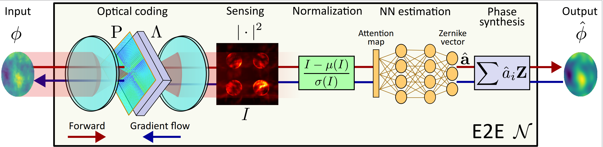
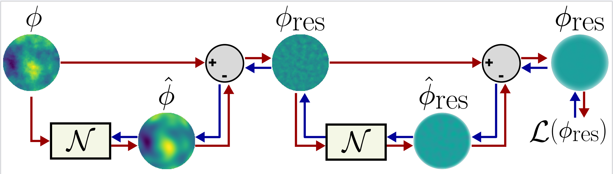

# DFWFS
Official implementation for "[Generalized Deep Fourier-ased Wavefront Sensing](https://preprints.opticaopen.org/articles/preprint/Deep_Optics_Preconditioner_for_Modulation-free_Pyramid_Wavefront_Sensing/23812041)"

  
**(a)** Optical layout of the system.

  
**(b)** Signal processing workflow.

# Installation
- Install anaconda (https://www.anaconda.com/products/distribution)
- On anaconda prompt (windows) or terminal (linux) create enviroment with the .yml file:

```
conda env create -f env.yml -n my_environment
conda activate my_environment
```

# Train
- In functions/utils there is a function called *select_routine* that contain the training scheme employed. There is a bunch of variables to vary but only three are modified 
  to obtain the different models: *nH*, *al*, and *init*. *nH* is the number of sides of the prism, where negative values yields zernike wavefront sensor and the special case *nH=-10* is ragazzoni. *al* is the variable that controls the phase amplitude; in the case of prism is the alpha value while for zwfs is the constant shift. To initialize the preconditioner with a given form, use *init* with negative value at the second position: *init=['constant',-4]* to initialize as pyramid.

  Then, execute the following command:

  ```
  python Train.py --nPx 128 --expName my_training --device cuda:0 --routine ns_all

  ```

# Reproducing Results
All the simulated results were obtained with this code. Here we briefly explain how to reproduce each plot.

## Open-loop
Open-loop results are obtained through the below commands, where *T* is the ammount of atmosphere averaged per point.

```
python3 test_ol.py --expName P_vNT0 --device cuda:0 --routine P_vNM0 --T 10000 --batch 100 --nHeads 2 3 4
python3 test_ol.py --expName NN_vNT0 --device cuda:1 --routine NN_vNM0 --T 10000 --batch 100 --nHeads 2 3 4
python3 test_ol.py --expName PNN_vNT0 --device cuda:2 --routine PNN_vNM0 --T 10000 --batch 100 --nHeads 2 3 4
```

## Closed-loop
Closed-loop plots are generated by the following code:

```
python3 test_cl.py --t 300 --cl 50 --psf_samp 2 --Dr0v 7.5 15 30 50 75 --ipsf 100 300 --expName CL_plot --routine nD50k_vNM0 --device cuda:0 --kp .3
```

In this case, *t* is the iterations, *cl* the kth-iteration where the loop is closed, *ipsf* the integration of the psfs, and *kp* the controller gain. In addition to plots of residual variance and strehl ratio, the figures of the paper are generated as well as the gifs for each $D/r_0$. 


# Citation
If you find our project useful, please cite us:

```
@article{guzman2024deep,
  title={Deep optics preconditioner for modulation-free pyramid wavefront sensing},
  author={Guzm{\'a}n, Felipe and Tapia, Jorge and Weinberger, Camilo and Hern{\'a}ndez, Nicol{\'a}s and Bacca, Jorge and Neichel, Benoit and Vera, Esteban},
  journal={Photonics Research},
  volume={12},
  number={2},
  pages={301--312},
  year={2024},
  publisher={Optica Publishing Group}
}
